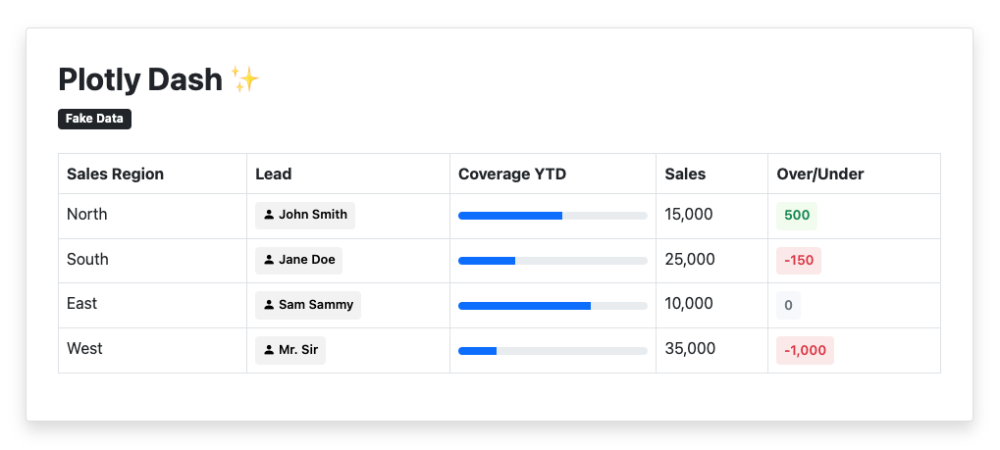

## Pretty Plotly Dash Table
**Pandas DataFrame inside Dash Bootstrap Table = ✨**

### How it works
Simply put, you can add columns of Bootstrap components (`dash-bootstrap-components`) to Pandas DataFrames. Bootstrap's `Table` component will render the HTML as expected. This is cool because you can create functions to dynamically add badges and progress bars based on the values of other columns. 

### Example

